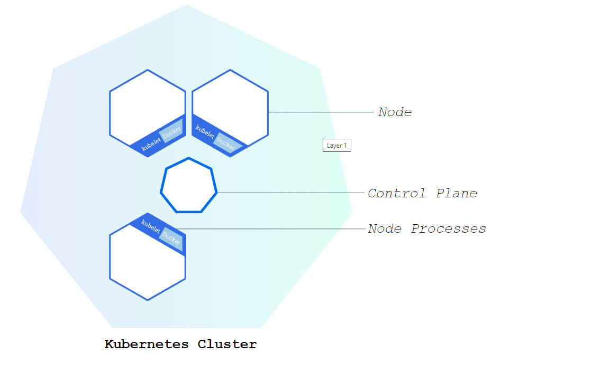
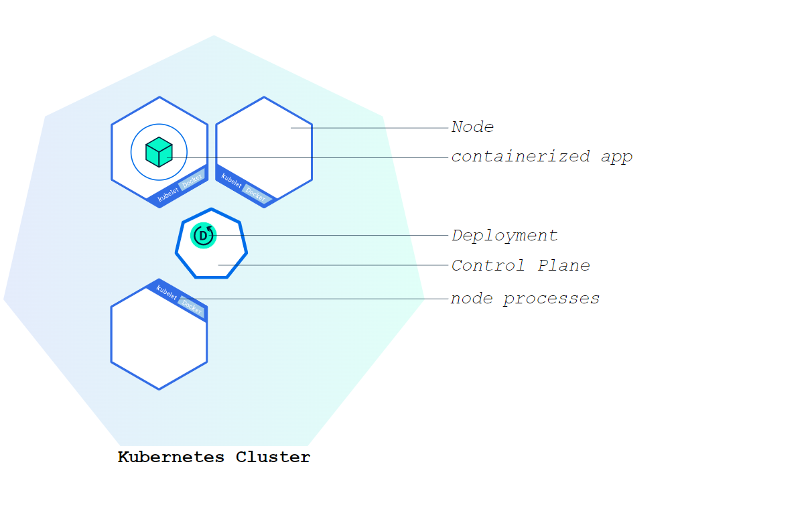
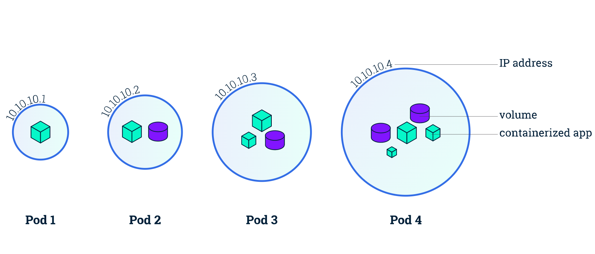
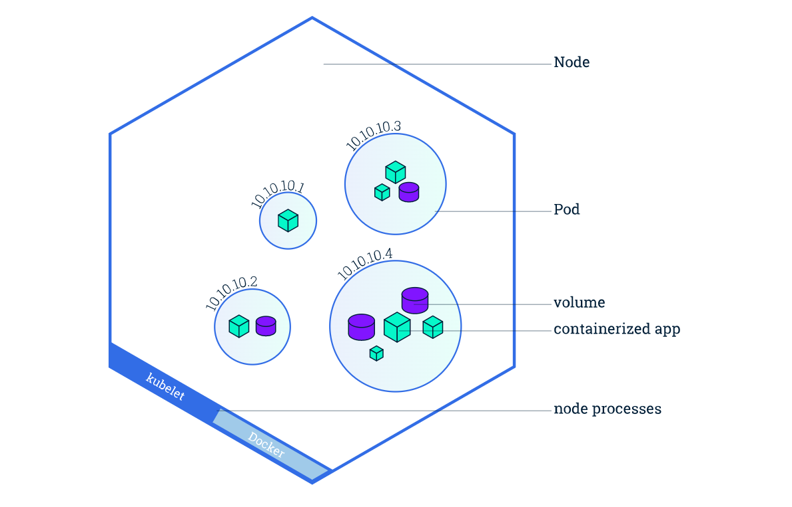
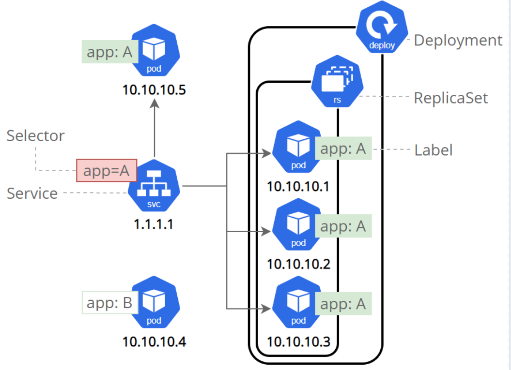
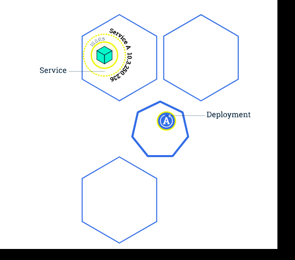
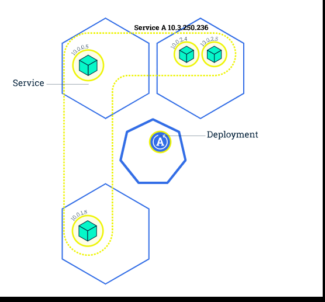

# Using Minikube to Create a Cluster

Objectives
Learn what a Kubernetes cluster is.
Learn what Minikube is.
Start a Kubernetes cluster using an online terminal.
Kubernetes Clusters
Kubernetes coordinates a highly available cluster of computers that are connected to work as a single unit. The abstractions in Kubernetes allow you to deploy containerized applications to a cluster without tying them specifically to individual machines. To make use of this new model of deployment, applications need to be packaged in a way that decouples them from individual hosts: they need to be containerized. Containerized applications are more flexible and available than in past deployment models, where applications were installed directly onto specific machines as packages deeply integrated into the host. Kubernetes automates the distribution and scheduling of application containers across a cluster in a more efficient way. Kubernetes is an open-source platform and is production-ready.

A Kubernetes cluster consists of two types of resources:

The Control Plane coordinates the cluster
Nodes are the workers that run applications

## Cluster Diagram

The Control Plane is responsible for managing the cluster. The Control Plane coordinates all activities in your cluster, such as scheduling applications, maintaining applications' desired state, scaling applications, and rolling out new updates.

A node is a VM or a physical computer that serves as a worker machine in a Kubernetes cluster. Each node has a Kubelet, which is an agent for managing the node and communicating with the Kubernetes control plane. The node should also have tools for handling container operations, such as containerd or Docker. A Kubernetes cluster that handles production traffic should have a minimum of three nodes because if one node goes down, both an etcd member and a control plane instance are lost, and redundancy is compromised. You can mitigate this risk by adding more control plane nodes.

Control Planes manage the cluster and the nodes that are used to host the running applications.

When you deploy applications on Kubernetes, you tell the control plane to start the application containers. The control plane schedules the containers to run on the cluster's nodes. The nodes communicate with the control plane using the Kubernetes API, which the control plane exposes. End users can also use the Kubernetes API directly to interact with the cluster.

A Kubernetes cluster can be deployed on either physical or virtual machines. To get started with Kubernetes development, you can use Minikube. Minikube is a lightweight Kubernetes implementation that creates a VM on your local machine and deploys a simple cluster containing only one node. Minikube is available for Linux, macOS, and Windows systems. The Minikube CLI provides basic bootstrapping operations for working with your cluster, including start, stop, status, and delete. For this tutorial, however, you'll use a provided online terminal with Minikube pre-installed.

Now that you know what Kubernetes is, let's go to the online tutorial and start our first cluster!
> - kubectl version
> - kubectl cluster-info
> - kubectl get nodes

# Using kubectl to Create a Deployment

Objectives
Learn about application Deployments.
Deploy your first app on Kubernetes with kubectl.
Kubernetes Deployments
Once you have a running Kubernetes cluster, you can deploy your containerized applications on top of it. To do so, you create a Kubernetes Deployment configuration. The Deployment instructs Kubernetes how to create and update instances of your application. Once you've created a Deployment, the Kubernetes control plane schedules the application instances included in that Deployment to run on individual Nodes in the cluster.

Once the application instances are created, a Kubernetes Deployment Controller continuously monitors those instances. If the Node hosting an instance goes down or is deleted, the Deployment controller replaces the instance with an instance on another Node in the cluster. This provides a self-healing mechanism to address machine failure or maintenance.

In a pre-orchestration world, installation scripts would often be used to start applications, but they did not allow recovery from machine failure. By both creating your application instances and keeping them running across Nodes, Kubernetes Deployments provide a fundamentally different approach to application management.

> - kubectl create deployment kubernetes-bootcamp --image=gcr.io/google-samples/kubernetes-bootcamp:v1
> - kubectl get deployments
> - echo -e "\n\n\n\e[92mStarting Proxy. After starting it will not output a response. Please click the first Terminal Tab\n"; 
> - kubectl proxy
> - curl http://localhost:8001/version
> - export POD_NAME=$(kubectl get pods -o go-template --template '{{range .items}}{{.metadata.name}}{{"\n"}}{{end}}')
> - echo Name of the Pod: $POD_NAME
> - curl http://localhost:8001/api/v1/namespaces/default/pods/$POD_NAME/

## Deploying your first app on Kubernetes

You can create and manage a Deployment by using the Kubernetes command line interface, Kubectl. Kubectl uses the Kubernetes API to interact with the cluster. In this module, you'll learn the most common Kubectl commands needed to create Deployments that run your applications on a Kubernetes cluster.

When you create a Deployment, you'll need to specify the container image for your application and the number of replicas that you want to run. You can change that information later by updating your Deployment; Modules 5 and 6 of the bootcamp discuss how you can scale and update your Deployments.

Applications need to be packaged into one of the supported container formats in order to be deployed on Kubernetes

For your first Deployment, you'll use a hello-node application packaged in a Docker container that uses NGINX to echo back all the requests. (If you didn't already try creating a hello-node application and deploying it using a container, you can do that first by following the instructions from the Hello Minikube tutorial).

Now that you know what Deployments are, let's go to the online tutorial and deploy our first app!

# Viewing Pods and Nodes

> - kubectl get pods
> - kubectl describe pods
> - echo -e "\n\n\n\e[92mStarting Proxy. After starting it will not output a response. Please click the first Terminal Tab\n"; kubectl proxy
> - export POD_NAME=$(kubectl get pods -o go-template --template '{{range .items}}{{.metadata.name}}{{"\n"}}{{end}}')
> - echo Name of the Pod: $POD_NAME
> - curl http://localhost:8001/api/v1/namespaces/default/pods/$POD_NAME/proxy/
> - kubectl logs $POD_NAME
> - kubectl exec $POD_NAME -- env
> - kubectl exec -ti $POD_NAME -- bash
> - cat server.js
> - curl localhost:8080
> 

Objectives
Learn about Kubernetes Pods.
Learn about Kubernetes Nodes.
Troubleshoot deployed applications.
Kubernetes Pods
When you created a Deployment in Module 2, Kubernetes created a Pod to host your application instance. A Pod is a Kubernetes abstraction that represents a group of one or more application containers (such as Docker), and some shared resources for those containers. Those resources include:

Shared storage, as Volumes
Networking, as a unique cluster IP address
Information about how to run each container, such as the container image version or specific ports to use
A Pod models an application-specific "logical host" and can contain different application containers which are relatively tightly coupled. For example, a Pod might include both the container with your Node.js app as well as a different container that feeds the data to be published by the Node.js webserver. The containers in a Pod share an IP Address and port space, are always co-located and co-scheduled, and run in a shared context on the same Node.

Pods are the atomic unit on the Kubernetes platform. When we create a Deployment on Kubernetes, that Deployment creates Pods with containers inside them (as opposed to creating containers directly). Each Pod is tied to the Node where it is scheduled, and remains there until termination (according to restart policy) or deletion. In case of a Node failure, identical Pods are scheduled on other available Nodes in the cluster.

## Pods overview

Nodes
A Pod always runs on a Node. A Node is a worker machine in Kubernetes and may be either a virtual or a physical machine, depending on the cluster. Each Node is managed by the control plane. A Node can have multiple pods, and the Kubernetes control plane automatically handles scheduling the pods across the Nodes in the cluster. The control plane's automatic scheduling takes into account the available resources on each Node.

Every Kubernetes Node runs at least:

Kubelet, a process responsible for communication between the Kubernetes control plane and the Node; it manages the Pods and the containers running on a machine.
A container runtime (like Docker) responsible for pulling the container image from a registry, unpacking the container, and running the application.

## Node overview

Troubleshooting with kubectl
In Module 2, you used Kubectl command-line interface. You'll continue to use it in Module 3 to get information about deployed applications and their environments. The most common operations can be done with the following kubectl commands:

> - kubectl get - list resources
> - kubectl describe - show detailed information about a resource
> - kubectl logs - print the logs from a container in a pod
> - kubectl exec - execute a command on a container in a pod
You can use these commands to see when applications were deployed, what their current statuses are, where they are running and what their configurations are.

Now that we know more about our cluster components and the command line, let's explore our application.

# Using a Service to Expose Your App
> - kubectl get pods
> - kubectl get services
> - kubectl expose deployment/kubernetes-bootcamp --type="NodePort" --port 8080
> - kubectl get services
> - kubectl describe services/kubernetes-bootcamp
> - export NODE_PORT=$(kubectl get services/kubernetes-bootcamp -o go-template='{{(index .spec.ports 0).nodePort}}')
> - echo NODE_PORT=$NODE_PORT
> - curl $(minikube ip):$NODE_PORT

> - kubectl describe deployment
> - kubectl get pods -l app=kubernetes-bootcamp
> - kubectl get services -l app=kubernetes-bootcamp
> - export POD_NAME=$(kubectl get pods -o go-template --template '{{range .items}}{{.metadata.name}}{{"\n"}}{{end}}')
> - echo Name of the Pod: $POD_NAME
> - kubectl label pods $POD_NAME version=v1
> - kubectl describe pods $POD_NAME
> - kubectl get pods -l version=v1

> - kubectl delete service -l app=kubernetes-bootcamp
> - kubectl get services
> - curl $(minikube ip):$NODE_PORT
> - kubectl exec -ti $POD_NAME -- curl localhost:8080
> 

Objectives
Learn about a Service in Kubernetes
Understand how labels and LabelSelector objects relate to a Service
Expose an application outside a Kubernetes cluster using a Service
Overview of Kubernetes Services
Kubernetes Pods are mortal. Pods have a lifecycle. When a worker node dies, the Pods running on the Node are also lost. A ReplicaSet might then dynamically drive the cluster back to the desired state via the creation of new Pods to keep your application running. As another example, consider an image-processing backend with 3 replicas. Those replicas are exchangeable; the front-end system should not care about backend replicas or even if a Pod is lost and recreated. That said, each Pod in a Kubernetes cluster has a unique IP address, even Pods on the same Node, so there needs to be a way of automatically reconciling changes among Pods so that your applications continue to function.

A Service in Kubernetes is an abstraction which defines a logical set of Pods and a policy by which to access them. Services enable a loose coupling between dependent Pods. A Service is defined using YAML (preferred) or JSON, like all Kubernetes objects. The set of Pods targeted by a Service is usually determined by a LabelSelector (see below for why you might want a Service without including a selector in the spec).

Although each Pod has a unique IP address, those IPs are not exposed outside the cluster without a Service. Services allow your applications to receive traffic. Services can be exposed in different ways by specifying a type in the ServiceSpec:

ClusterIP (default) - Exposes the Service on an internal IP in the cluster. This type makes the Service only reachable from within the cluster.
NodePort - Exposes the Service on the same port of each selected Node in the cluster using NAT. Makes a Service accessible from outside the cluster using <NodeIP>:<NodePort>. Superset of ClusterIP.
LoadBalancer - Creates an external load balancer in the current cloud (if supported) and assigns a fixed, external IP to the Service. Superset of NodePort.
ExternalName - Maps the Service to the contents of the externalName field (e.g. foo.bar.example.com), by returning a CNAME record with its value. No proxying of any kind is set up. This type requires v1.7 or higher of kube-dns, or CoreDNS version 0.0.8 or higher.
More information about the different types of Services can be found in the Using Source IP tutorial. Also see Connecting Applications with Services.

Additionally, note that there are some use cases with Services that involve not defining a selector in the spec. A Service created without selector will also not create the corresponding Endpoints object. This allows users to manually map a Service to specific endpoints. Another possibility why there may be no selector is you are strictly using type: ExternalName.

Summary
Exposing Pods to external traffic
Load balancing traffic across multiple Pods
Using labels
A Kubernetes Service is an abstraction layer which defines a logical set of Pods and enables external traffic exposure, load balancing and service discovery for those Pods.

Services and Labels

A Service routes traffic across a set of Pods. Services are the abstraction that allows pods to die and replicate in Kubernetes without impacting your application. Discovery and routing among dependent Pods (such as the frontend and backend components in an application) are handled by Kubernetes Services.

Services match a set of Pods using labels and selectors, a grouping primitive that allows logical operation on objects in Kubernetes. Labels are key/value pairs attached to objects and can be used in any number of ways:

Designate objects for development, test, and production
Embed version tags
Classify an object using tags

Labels can be attached to objects at creation time or later on. They can be modified at any time. Let's expose our application now using a Service and apply some labels.

# Running Multiple Instances of Your App

  
> - kubectl get deployments
> - kubectl get rs
> - kubectl scale deployments/kubernetes-bootcamp --replicas=4
> - kubectl get deployments
> - kubectl get pods -o wide
> - kubectl describe deployments/kubernetes-bootcamp
> - kubectl describe services/kubernetes-bootcamp
> - export NODE_PORT=$(kubectl get services/kubernetes-bootcamp -o go-template='{{(index .spec.ports 0).nodePort}}')
> - echo NODE_PORT=$NODE_PORT
> - curl $(minikube ip):$NODE_PORT
  
> - kubectl scale deployments/kubernetes-bootcamp --replicas=2
> - kubectl get deployments
> - kubectl get pods -o wide
>   
  
  
Objectives
Scale an app using kubectl.
Scaling an application
In the previous modules we created a Deployment, and then exposed it publicly via a Service. The Deployment created only one Pod for running our application. When traffic increases, we will need to scale the application to keep up with user demand.

Scaling is accomplished by changing the number of replicas in a Deployment

## Scaling overview

Scaling out a Deployment will ensure new Pods are created and scheduled to Nodes with available resources. Scaling will increase the number of Pods to the new desired state. Kubernetes also supports autoscaling of Pods, but it is outside of the scope of this tutorial. Scaling to zero is also possible, and it will terminate all Pods of the specified Deployment.

Running multiple instances of an application will require a way to distribute the traffic to all of them. Services have an integrated load-balancer that will distribute network traffic to all Pods of an exposed Deployment. Services will monitor continuously the running Pods using endpoints, to ensure the traffic is sent only to available Pods.

Scaling is accomplished by changing the number of replicas in a Deployment.

Once you have multiple instances of an Application running, you would be able to do Rolling updates without downtime. We'll cover that in the next module. Now, let's go to the online terminal and scale our application.

# Performing a Rolling Update

Objectives
> - kubectl get deployments
> - kubectl get pods
> - kubectl describe pods
> - kubectl set image deployments/kubernetes-bootcamp kubernetes-bootcamp=jocatalin/kubernetes-bootcamp:v2
> - kubectl get pods

> - kubectl describe services/kubernetes-bootcamp
> - export NODE_PORT=$(kubectl get services/kubernetes-bootcamp -o go-template='{{(index .spec.ports 0).nodePort}}')
> - echo NODE_PORT=$NODE_PORT  
> - curl $(minikube ip):$NODE_PORT
> - kubectl rollout status deployments/kubernetes-bootcamp
> - kubectl describe pods

> - kubectl set image deployments/kubernetes-bootcamp kubernetes-bootcamp=gcr.io/google-samples/kubernetes-bootcamp:v10
> - kubectl get deployments
> - kubectl get pods
> - kubectl describe pods
> - kubectl rollout undo deployments/kubernetes-bootcamp
> - kubectl get pods
> - kubectl describe pods

  
  
Perform a rolling update using kubectl.
Updating an application
Users expect applications to be available all the time and developers are expected to deploy new versions of them several times a day. In Kubernetes this is done with rolling updates. Rolling updates allow Deployments' update to take place with zero downtime by incrementally updating Pods instances with new ones. The new Pods will be scheduled on Nodes with available resources.

In the previous module we scaled our application to run multiple instances. This is a requirement for performing updates without affecting application availability. By default, the maximum number of Pods that can be unavailable during the update and the maximum number of new Pods that can be created, is one. Both options can be configured to either numbers or percentages (of Pods). In Kubernetes, updates are versioned and any Deployment update can be reverted to a previous (stable) version.

## Rolling updates overview

Similar to application Scaling, if a Deployment is exposed publicly, the Service will load-balance the traffic only to available Pods during the update. An available Pod is an instance that is available to the users of the application.

Rolling updates allow the following actions:

Promote an application from one environment to another (via container image updates)
Rollback to previous versions
Continuous Integration and Continuous Delivery of applications with zero downtime
If a Deployment is exposed publicly, the Service will load-balance the traffic only to available Pods during the update.

In the following interactive tutorial, we'll update our application to a new version, and also perform a rollback.
